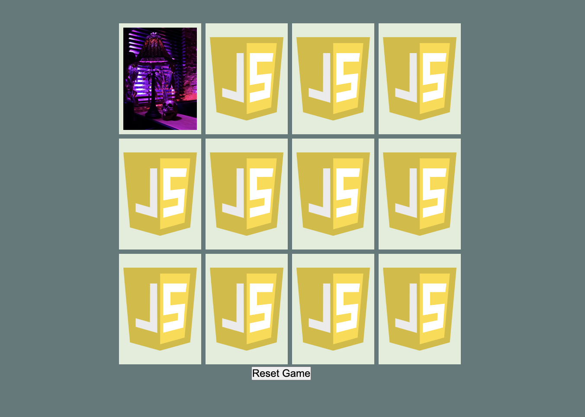

# Description
This project is a simple game of memory. Click on cards to find matches! The project was built with a focus on functional programming as opposed to object oriented programming. Vanilla Javascript & CSS were used along with DOM manipulation to create interactive gameplay with the HTML elements.

# Gameplay looks like this!

You will be clicking on cards to flip them over. The goal is to try and uncover matching pairs.

# Features
As a user, I can have hours and hours of fun pushing my memory to its limits!!!!

If two non matching cards are flipped you must wait until they reface in order to click the next card.

The reset button located below the game board will reset the game whenever you wish. A new shuffle will be applied to each fresh game.

# list of technology used
- CSS
- javascript
- HTML

# Getting Started

Open the program in a browser and start clicking on cards! When you have found all the matches, click the reset button to have another go at it!

# Deployed Link

www.overt-library.surge.sh

# Contribution Guidelines

Please feel free to make and submit improvements for review!

### repo & issue link below

[repo link](https://github.com/bryan-emerson/bryan-emerson.github.io)

[submit issues here](https://github.com/bryan-emerson/bryan-emerson.github.io/issues)